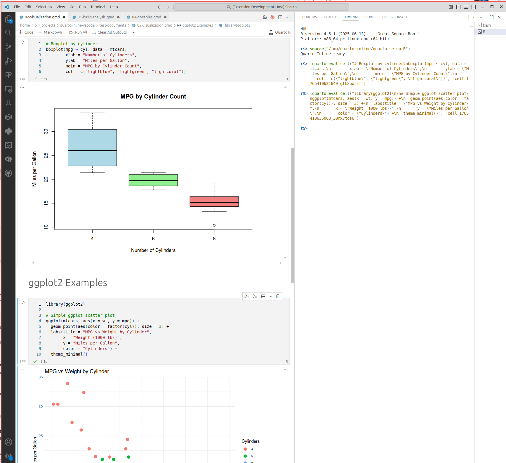
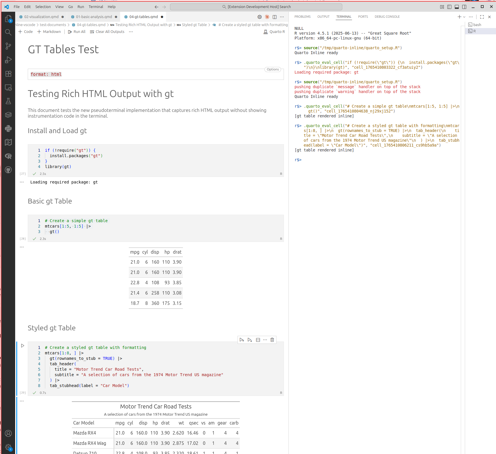
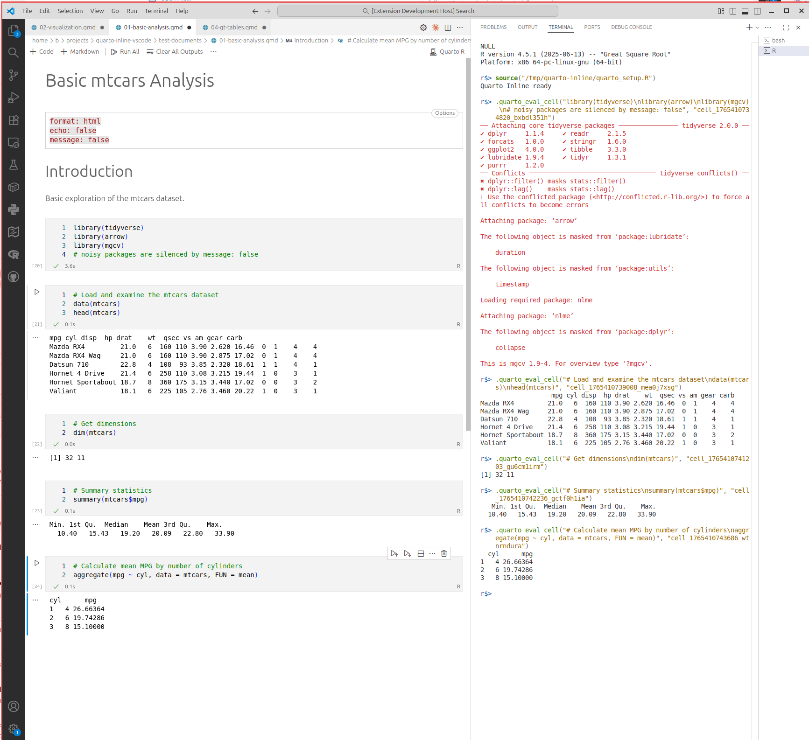

# Quarto Inline Output

Display code chunk outputs inline in Quarto documents, similar to Jupyter notebooks in VSCode, but with a functional R terminal session. 

## Motivation

RStudio's execution model is fantastic for iterative and interactive workflows where you need to be able to work with stateful data outside of the context your notebook. This is especially useful for data exploration and social science modeling contexts where the development loop is short and focused on outputs. 

Positron is a great tool but it does not support inline chunk output - that means you have to look at your console output "outside of the weave" of your notebook. 

This plugin for vscode provides a trade-off, it evaluates chunks inside of some instrumentation code in exchange for inline outputs.

## Features

- Inline Output Display: Run R code chunks and see results directly below, just like in RStudio
- Visual Results: Text output, plots, and tables rendered inline in your Quarto document. Support for ggplot2, gt, prints/mesage and base R plots.
- Interactive Terminal: Execute chunks in a visible terminal session that maintains state
- Jupyter-style UX: Click "▶ Run" buttons or use `Cmd/Ctrl+Enter` to execute chunks. Reloads last visible outputs like Jupyter  
- Supports R (MVP), Python (planned)
- Respects mesage: t/f setting for Quarto

### Screenshots

<details open>
<summary><strong>R Plots</strong></summary>



</details>

<details>
<summary><strong>R GT Tables</strong></summary>



</details>

<details>
<summary><strong>R Summary</strong></summary>



</details>

## Why This Extension?

Quarto documents in VSCode currently lack inline output display:
- **RStudio**: Output appears directly below chunks
- **VSCode**: Output only shows in terminal, no inline visualization

This is a [known limitation](https://github.com/quarto-dev/quarto-cli/discussions/3598) of the Quarto VSCode extension. This extension bridges that gap.

## Requirements

- VSCode 1.85.0 or higher
- R installed and available in PATH
- Quarto extension (recommended but not required)

## Installation

### From Source (Development)

1. Clone this repository:
   ```bash
   git clone https://github.com/1beb/quarto-inline-output.git
   cd quarto-inline-output
   ```

2. Install dependencies:
   ```bash
   npm install
   ```

3. Compile the extension:
   ```bash
   npm run compile
   ```

4. Install locally:
   ```bash
   code --install-extension .
   ```

   Or for development, open the project in VSCode and press `F5` to launch the Extension Development Host.

### From VSIX (Local Install)

1. Package the extension:
   ```bash
   npm install -g @vscode/vsce
   vsce package
   ```

2. Install the generated `.vsix` file:
   ```bash
   code --install-extension quarto-inline-output-0.1.0.vsix
   ```

   Or in VSCode: Extensions view → `...` menu → Install from VSIX

## Usage

1. Open a `.qmd` file in VSCode
2. See "▶ Run" buttons appear above each R code chunk
3. Click the button or press `Cmd/Ctrl+Enter` with cursor in chunk
4. View output inline below the chunk:
   - Console output
   - Plots and visualizations
   - Error messages
5. Switch to the terminal to interact with the R session directly

 <!-- TODO: Add demo GIF -->

### Keyboard Shortcuts

- `Cmd/Ctrl+Enter`: Run current chunk

### Commands

- `Quarto Inline Output: Run Chunk` - Execute the current code chunk
- `Quarto Inline Output: Refresh` - Refresh code lens buttons

## Configuration

Configure the extension in your VSCode settings:

```json
{
  "quarto-inline-output.autoShowTerminal": true,
  "quarto-inline-output.defaultFigWidth": 800,
  "quarto-inline-output.defaultFigHeight": 600,
  "quarto-inline-output.clearOutputOnRun": false
}
```

## How It Works

The extension:
1. Parses your `.qmd` file to identify code chunks
2. Wraps chunk code with output capture logic
3. Executes code in a persistent terminal session
4. Captures text output and saves plots to temp files
5. Renders results inline using VSCode decorations

State persists between chunk executions, so variables and loaded packages remain available.

## Development

### Project Structure

```
quarto-inline-output/
├── src/
│   ├── extension.ts          # Entry point
│   ├── chunkParser.ts        # Parse code chunks
│   ├── codeLensProvider.ts   # Run buttons
│   ├── executors/            # Language executors
│   ├── decorationManager.ts  # Inline rendering
│   └── terminalManager.ts    # Terminal management
├── test-documents/           # Test .qmd files
└── docs/plans/              # Implementation plans
```

### Building from Source

```bash
npm install
npm run compile
npm run watch  # Auto-compile on changes
```

### Testing

```bash
npm test
```

Or press `F5` in VSCode to launch Extension Development Host.

### Contributing

See [docs/plans/2025-11-22-quarto-inline-output.md](docs/plans/2025-11-22-quarto-inline-output.md) for detailed implementation plan.

## Roadmap

- [x] Project design and planning
- [x] MVP: R text output support (v0.1.0 - hover-based, see `inline-with-hover` branch)
- [x] Notebook API implementation (v0.2.0 - current)
- [ ] R plot support
- [ ] Python support
- [ ] Enhanced output formatting
- [ ] Configuration UI
- [ ] Marketplace publication

## Current Status (v0.2.0)

The extension now uses VSCode's Notebook API to provide true inline output display, similar to Jupyter notebooks. This replaces the earlier hover-based approach.

**Implemented:**
- Notebook serializer for `.qmd` ↔ notebook cells conversion
- Notebook controller for cell execution via terminal
- View switching between text and notebook modes
- Chunk option preservation in cell metadata
- Clean round-tripping (outputs not saved to files)

**Next Steps:**
- Add plot output support using custom renderers
- Extend to Python language support
- Improve chunk options UI in notebook view

## Known Limitations

- Currently supports R only (Python planned)
- Plot output not yet supported (text output only)
- Chunk options must be edited in text view
- Terminal-based execution only (no background execution)

## License

MIT

## Acknowledgments

Inspired by:
- RStudio's inline chunk execution
- Jupyter notebook extension for VSCode
- Quarto development team's work on VSCode integration
